# Prusa Log Processor

## Processor setup

You can run simply docker run of container. 

`docker run pubeldev/prusa_log_processor`

Or you can run binary, no configuration but everything necessary is possible to set via flags. You can config several paramaters.


```
exporter.metrics-path - Path where to expose metrics - default - "/metrics"
exporter.metrics-port - Port where to expose metrics - default - "10010"
processor.address - Address where to expose port for gathering logs - default - "0.0.0.0.13514"
processor.log-to - Write logs to file - default - "false"
processor.directory - Directory where to store logs - default - "./logs"
processor.filename - Filename where to store logs - default - "prusa.log"
processor.max-size - Maximum size of log file - default - "10"
processor.max-backups - Maximum number of backups - default - "3"
processor.max-age - Maximum age of log file - default - "28"
log.level - Log level for prusa_log_processor - default - "info"
```

Example 

```
./prusa_exporter-linux-amd64 --processor.address=0.0.0.0:424242 --log.level=debug --exporter.metrics-port=9090
```

## Enable SYSLOG in printer

To gather logs you have to allow sending logs to `prusa_log_processor`. You have to create `config.gcode` that will contain M340 command which set up log server address. Bellow you'll find manual how to set up your printer. Example 

```
M340 192.168.20.2 13514
```

After loading gcode on to flash drive you can enable the metrics in printer.

Open `Settings`  
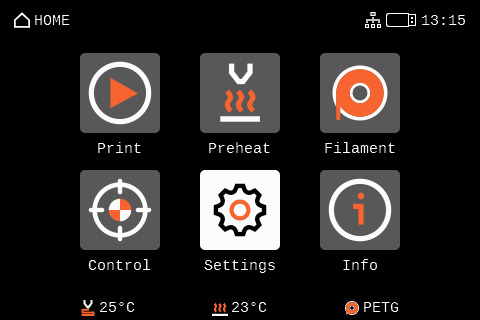  

Navigate to `Network`  
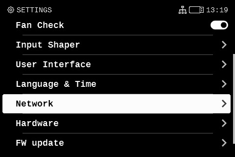  

Find `Metrics & Log`  
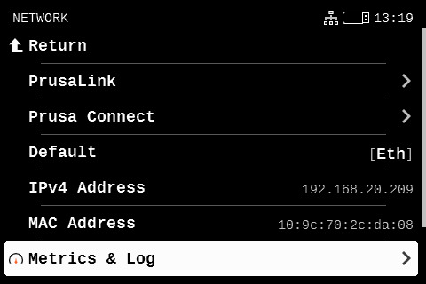  

Now click on `Allow` - Confirm and change value to `Any Host`. Next switch on `Enabled Stored at Startup`  
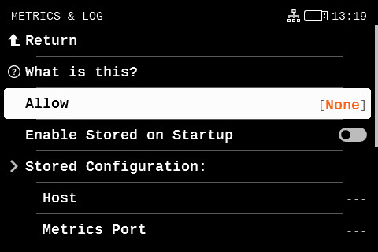  
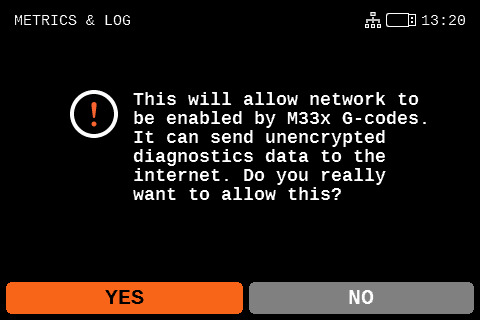  
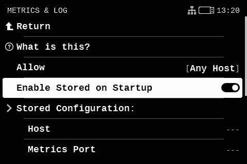  

Now run your configuration gcode we created before  
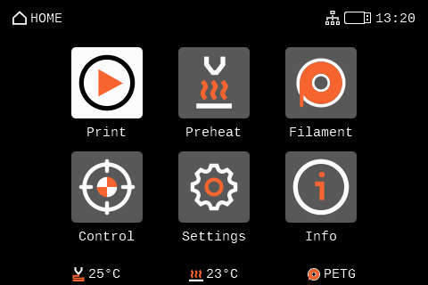  
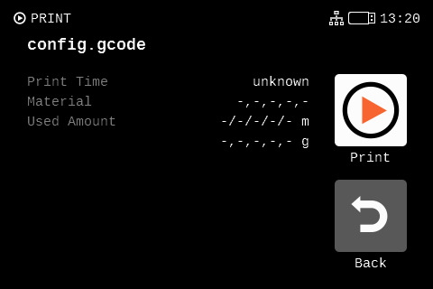  

Navigate back to `Metrics & Log` and find `Current Configuration` - click on `Logs Host` and store it as Host   
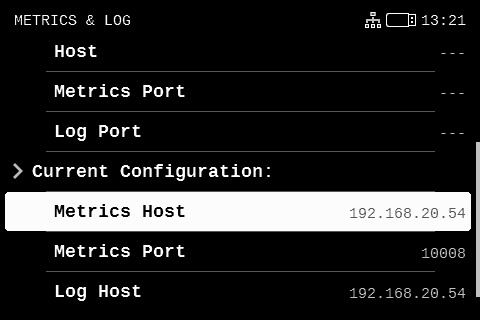  
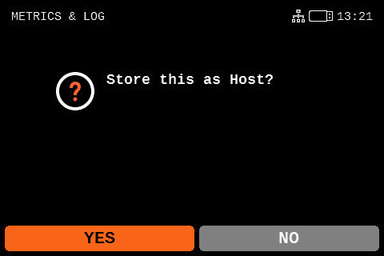  

Click on `Logs Port` and store it as Metrics Port  
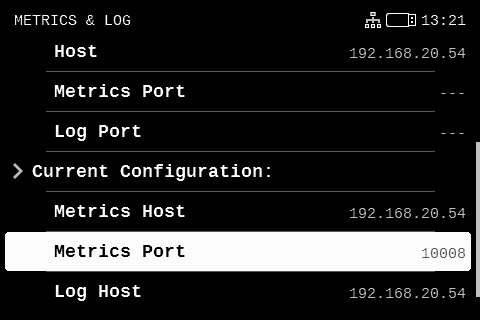  
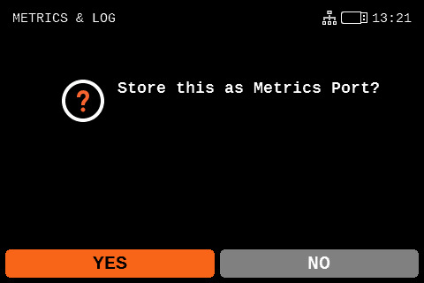  

After configuration it should look like this. Only IP address should be different. And if different port was choosen then also port.  
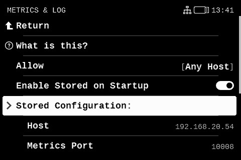  
